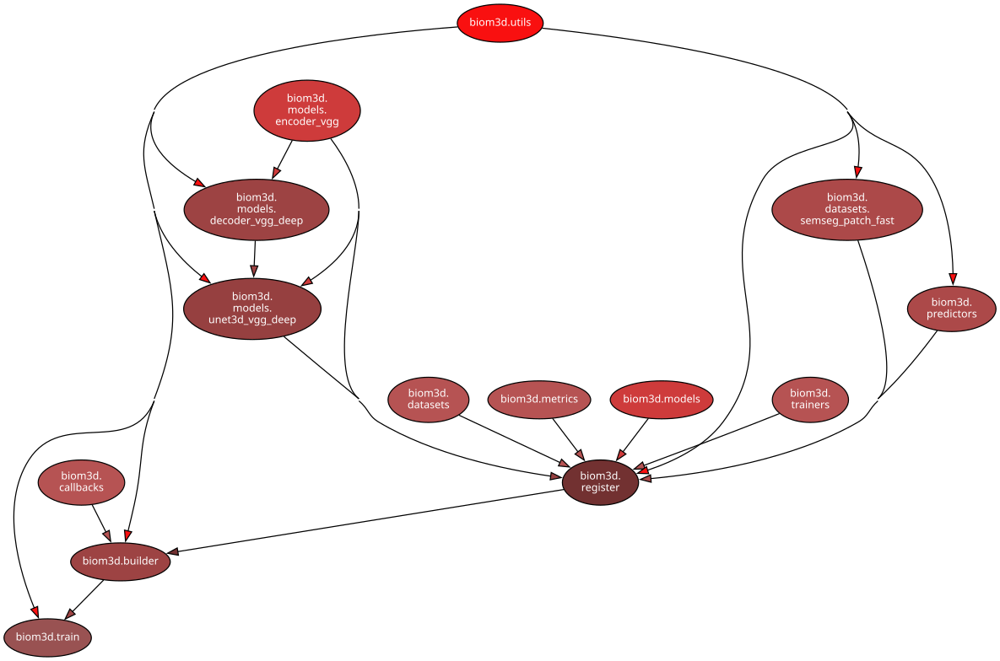
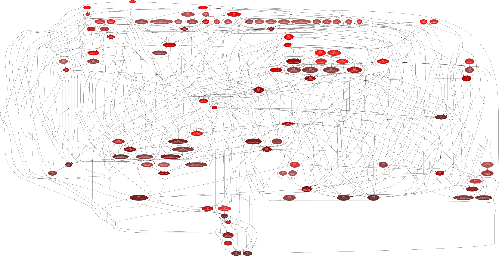
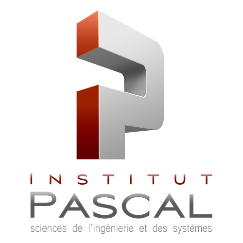

# :microscope: Biom3d 

[**Documentation**](https://biom3d.readthedocs.io/)

**Warning! This repository is still a work in progress.**

An easy-to-use and unofficial implementation of [nnUNet](https://github.com/MIC-DKFZ/nnUNet).

Biom3d modules             |  nnUNet modules
:-------------------------:|:-------------------------:
  |  

*Illustrations generated with `pydeps` module*

The goal of Biom3d (and of the original nnUNet) is to automatically configured the training of a U-Net deep learning model for 3D semantic segmentation.

Biom3d is yet more flexible for developers than the original nnUNet implementation: easier to read/understand and easier to edit. Biom3d has also been made easy-to-use for community users.

Biom3d does not include ensemble learning, the possibility to use 2D U-Net or 3D-Cascade U-Net or Pytorch parallel computing yet. However, these options could easily be adapted if needed.

There are two main types of users of Biom3d:

* Community users, who are interested in using the basic features of Biom3d: GUI, predictions with ready-to-use models or basic training.
* Deep-learning developers, who are interested in more advanced features: configuration of module parameters, writing of new Biom3d modules, Biom3d core editing etc.

In the following documentation, we marked the advanced features with :rocket: symbol.

For Windows users, the paths are here written in "linux-like format". You will have to change '/' symbols to '\\' symbols in the command lines. 

## :hammer: Installation

**Please check our documentation for the installation details:** [**Documentation-Installation**](https://biom3d.readthedocs.io/en/latest/installation.html)

## :hand: Usage

**For Graphical User Interface users, check our new documentation!** [**Documentation-GUI**](https://biom3d.readthedocs.io/en/latest/quick_run_gui.html)

Two options:
* If you have a trained model (you can use one of the publicly available one), you can do [predictions](#prediction) directly.
* If you do not have a trained model, you must train one and, to do so, you must preprocess your data and create a configuration file. 

Three steps to train a new model:
* [data preprocessing to tif format (both images and ground truth masks)](#preprocessing)
* [configuration file definition](#configuration-file-definition)
* [training](#training)

### Training preprocessing 

Preprocessing consists in transforming the training images and masks to the appropriate format for both training and prediction.

#### Folder structure

The training images and masks must all be placed inside two distinct folders:

    training_folder
    ├── images
    │   ├── image_01.tif
    │   ├── image_02.tif
    │   └── ...
    └── masks
        ├── image_01.tif
        ├── image_01.tif
        └── ...

About the naming, the only constraint is that the images and masks have the exact same name. All the folders can have any name **with no space in it** and the parent folder structure does not matter.

#### Image format

To help formatting the images to the correct format, we have written a preprocessing script (preprocess.py). More details are available in [the next section](#helper-function).

Constraints:
- The images and masks must be .tif files. 
- The images and masks must all have 4 dimensions: (channel, height, width, depth).
- Each dimension of each image must be identical to each dimension of the corresponding mask, expect for the channel dimension.
- Images must be stored in float32 format (numpy.float32).
- Masks must be stored in byte format (numpy.byte) or int64 format (numpy.int64 or python int type).
- Masks values must be 0 or 1. Each mask channel represents one type of object. Masks do not have to be 'one-hot' encoded as we use sigmoid activation and not softmax activation. 

Recommandations: (the training might work well without these constraints)
- Images values must be Z-normalized 

#### Helper function

We defined a function in `biom3d/preprocess.py` to help preprocess the images.

Here is an example of how to use it:

```
python biom3d/preprocess.py --img_dir path/to/image/folder --img_out_dir path/to/preprocessed/image/folder --msk_dir path/to/mask/folder --msk_out_dir path/to/preprocessed/mask/folder --auto_config
```

The `--auto_config` option is recommended. It helps you complete the configuration file by providing you the ideal patch size, batch size and number of poolings depending of the median size of the dataset images.

### Training configuration file definition

All of the hyper-parameters are defined in the configuration file. The configuration files are stored in Python format in the `configs` folder. You can create a new config file by copy/paste one of the existing ones and by adapting the parameters defined below. For instance, copy/paste and rename `unet_pancreas.py` in the same folder and open this Python script with your favourite text editor. 

There are two types of hyper-parameters in the configuration file: builder parameters and modules parameters. 

#### Builder parameters

Builder parameters are written as follows: `NAME=value`. The dataset builder parameters must be adapted to your own dataset and the Auto-config builder parameters value can be set with the pre-processing values. The rest of the builder parameters is optional. 

Here is the exhaustive list of builder parameters:

```python
#---------------------------------------------------------------------------
# Dataset builder-parameters
# EDIT THE FOLLOWING PARAMATERS WITH YOUR OWN DATASETS PARAMETERS

# Folder where pre-processed images are stored
IMG_DIR = 'data/pancreas/tif_imagesTr_small'

# Folder where pre-processed masks are stored
MSK_DIR = 'data/pancreas/tif_labelsTr_small'

# (optional) path to the .csv file storing "filename,hold_out,fold", where:
# "filename" is the image name,
# "hold_out" is either 0 (training image) or 1 (testing image),
# "fold" (non-negative integer) indicates the k-th fold, 
# by default fold 0 of the training image (hold_out=0) is the validation set.
CSV_DIR = 'data/pancreas/folds_pancreas.csv'

# CSV_DIR can be set to None, in which case the validation set will be
# automatically chosen from the training set (20% of the training images/masks)
# CSV_DIR = None 

# model name
DESC = 'unet_mine-pancreas_21'

# number of classes of objects
# the background does not count, so the minimum is 1 (the max is 255)
NUM_CLASSES=2

#---------------------------------------------------------------------------
# Auto-config builder-parameters
# PASTE AUTO-CONFIG RESULTS HERE

# batch size
BATCH_SIZE = 2

# patch size passed to the model
PATCH_SIZE = [40,224,224]

# larger patch size used prior rotation augmentation to avoid "empty" corners.
AUG_PATCH_SIZE = [48,263,263]

# number of pooling done in the UNet
NUM_POOLS = [3,5,5]

# median spacing is used only during prediction to normalize the output images
# it is commented here because we did not noticed any improvemet
# MEDIAN_SPACING=[0.79492199, 0.79492199, 2.5]
MEDIAN_SPACING=[]

#---------------------------------------------------------------------------
# Advanced paramaters (can be left as such) 
# training configs

# whether to store also the best model 
SAVE_BEST = True 

# number of epochs
# the number of epochs can be reduced for small training set (e.g. a set of 10 images/masks of 128x128x64)
NB_EPOCHS = 1000

# optimizer paramaters
LR_START = 1e-2 # comment if need to reload learning rate after training interruption
WEIGHT_DECAY = 3e-5

# whether to use deep-supervision loss:
# a loss is placed at each stage of the UNet model
USE_DEEP_SUPERVISION = False

# whether to use softmax loss instead of sigmoid
# should not be set to True if object classes are overlapping in the masks
USE_SOFTMAX=False 

# training loop parameters
USE_FP16 = True
NUM_WORKERS = 4

#---------------------------------------------------------------------------
# callback setup (can be left as such) 
# callbacks are routines that execute periodically during the training loop

# folder where the training logs will be stored, including:
# - model .pth files (state_dict)
# - image snapshots of model training (only if USE_IMAGE_CLBK is True)
# - logs with this configuration stored in .yaml format and tensorboard logs
LOG_DIR = 'logs/'

SAVE_MODEL_EVERY_EPOCH = 1
USE_IMAGE_CLBK = True
VAL_EVERY_EPOCH = SAVE_MODEL_EVERY_EPOCH
SAVE_IMAGE_EVERY_EPOCH = SAVE_MODEL_EVERY_EPOCH
USE_FG_CLBK = True
#---------------------------------------------------------------------------

```

#### :rocket: Module parameters

The modules parameters are written as follows in the configuration file:

```python
NAME=Dict(
  fct="RegisterName"
  kwargs=Dict(
    key_word=arguments,
  )
)
```

The `fct` argumentation correspond to one of the module name listed in the `register.py` file. The `register.py` file lists all existing modules in Biom3d. To have more details about one specific module, we recommended to read the documentation of the module. There are currently 5 main modules type: dataset, model, metric, trainer and predictor. Each modules are not compatible with all modules, read the documentation for more details.

### :muscle: Training

Please create a folder named `logs/` in the current directory. 

Once the configuration file is defined, the training can start with the following command:

```
python biom3d/train.py --config configs.your_config_file
```

Careful, do not put `.py` in the end of your config file name. 

A new sub-folder, that we dubbed base-folder in this documentation, will be created in the `logs/` folder. The base-folder contains 3 sub-folders:
* `image`: with the snapshots of the current training results
* `log`: with the configuration files stored in Yaml format and with Tensorboard event file
* `model`: with the Pytorch model(s). 

You can plot the training curves during model training with the following command:

```
tensorboard --logdir=logs/
```

#### :rocket: Advanced training/evaluation/prediction

Biom3d has originally been designed to fasten state-of-the-art tools development for 3d bio-medical imaging, that's why it possible to run in a single command: the training, the test prediction and the test metrics computations. Use `python biom3d/train.py --help` to get more details.

### :dart: Prediction

Once your model is trained, it is ready to use for prediction with the following command:

``` 
python biom3d/pred.py --bui_dir path/to/base-folder --dir_in path/to/raw/data --dir_out path/of/the/future/predictions 
```

For Omero user, you can use the following command to download a Omero Dataset or a Omero Project and to directly run the prediction over this dataset:

```
python biom3d/omero_pred.py --obj Dataset:ID
```

or with a Omero Project

```
python biom3d/omero_pred.py --obj Project:ID
```

The previous command will ask you to provide your omero server name, your omero identification and your omero password. 

#### :rocket: Advanced prediction

`pred.py` can also be used to compare the prediction results with existing test annotations. Use `python biom3d/pred.py --help` for more details.

## :bookmark_tabs: Citation

If you find Biom3d useful in your research, please cite:

```
@misc{biom3d,
  title={{Biom3d} Easy-to-use Tool for 3D Semantic Segmentation of Volumetric Images using Deep Learning},
  author={Guillaume Mougeot},
  howpublished = {\url{https://github.com/GuillaumeMougeot/biom3d}},
  year={2022}
  }
```

## :moneybag: Fundings and Acknowledgements 

This project has been inspired by the following publication: "nnU-Net: a self-configuring method for deep learning-based biomedical image segmentation", Fabian Isensee et al, Nature Method, 2021.

This project has been supported by Oxford Brookes University and the European Regional Development Fund (FEDER). It was carried out between the laboratories of iGReD (France), Institut Pascal (France) and Plant Nuclear Envelop (UK).

<p align="middle">
  
  
  
  
  
  
</p>


