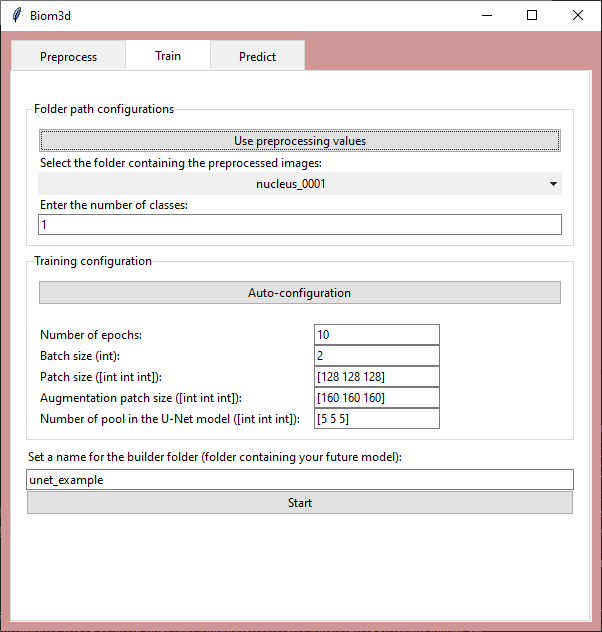

# Quick run with the Graphical User Interface

Starting the Graphical User Interface of biom3d depends on the type of installation you followed:
* If you installed biom3d with the directly link toward the executable file, you can simply double-click on the downloaded file.
* If you installed biom3d with the API or the source code, you can start the GUI with `python -m biom3d.gui -L`.

> Warning: the version of the GUI on GitHub is remote only, which means that you must also install the API on a server. If you would like to train your deep learning model locally and use the GUI, please install the API. 

## Splash screen

  

Biom3d comes with 2 modes: local or remote. 'Local' means that the computation will be executed on your computer. 'Remote' means that the computations will be executed on a distant computer where the API of biom3d has been installed. The aspect of the GUI will slightly change depending on the chosen mode.

If you have installed biom3d with the local version simply click on the 'Start locally' button to start.

If you have installed biom3d with the remote version, you must then complete the required fields. The first one is the IP address of your remote computer (where the API of biom3d is installed). The second and third one is your user name and password to connect to the remote computer. (Please ignore the forth one, it is deprecated).

## Preprocessing 

The preprocessing is executed locally independently of the choice to start locally or remotely. The current images and masks format that are accepted by the GUI are TIFF files ('.tif' extension) and NIFTI ('.nii.gz' extension).

> Note: The goals of the preprocessing are to standardize the input image and mask formats and to fasten the training process. During the preprocessing the images and masks will be converted to TIFF files ('.tif' extension). Each voxel intensity of the images will be Z-normalized (with a subtraction by the mean intensity and a division by the standard deviation of the intensities in one image). 

### Local

  

Browse through your folders to locate your image folder and mask folder, where your images and masks are stored in TIFF or NIFTI format.

Enter then the number of classes in your masks. The number of classes are the number of objects inside your images. For example, if you have annotated in your mask a pancreas with the label 1 and a tumor with label 2, you can entre '2' in this third field'.

The forth and fifth fields are optional. They indicate in which folder the preprocessed images and masks will be stored. By default, the preprocessed images and masks will be stored along the original images and masks folders.

Press then the 'Start' button to start the preprocessing. You can see in the terminal opened with biom3d if any error message appears.

### Remote

  

The 5 first fields corresponds are similar to the local version of the GUI. Follow the previous section for more details.

Once the preprocessing is done, you can send the preprocessed folders to your remote computer. First chose a nice and unique name for your new dataset and complete the last field. Then send your dataset by pressing the 'Send data to remote server' button.

## Train

Once your dataset is preprocessed, the training can now start. Training consists in using the preprocessed dataset to automatically adjust the parameters of a deep learning model (here the U-Net model).

### Local

  

#### Data configuration

The button "Use preprocessing value" is here to help you if you just have done a preprocessing. This button will copy the values defined in the preprocessing tab here in the training tab.

In case you do not have just done a preprocessing and would like to use an existing preprocessed dataset, browse through your computer folders to find your preprocessed image folder and your preprocessed mask folder. Set then the number of classes in your masks.

#### Training configuration

Once the preprocessing data fields completed, configure the training hyper-parameters by either pressing the "Auto-configuration" button or set the parameters manually. The "Auto-configuration" will choose for you the best configuration except the number of epochs which should be define manually. 

> Note: The default value of the number of epochs is 10 but 10 is quite small and should be increased if needed. 

> Note: The rest of the hyper-parameters is automatically set depending on the median size of the 3D images of the dataset. 3D images are often too big to fit into memory when training a deep learning model, so their number and size must be regulated. The default values have be setup for a computer having a GPU of 12Go of VRAM. In the case where you have access to a larger GPU it could be interesting to increase the values of the training configuration. The batch size is a positive integer defining the number of images that will be used passed to the model simultaneously. A batch size of 2 is a good default to allow the model to see simultaneously several images and not too big to prevent any memory problem. The patch size is a triplet of positive integers defining the size of the crop applied to a 3D image. Each patch will be randomly rotated to give to the model different point of view. Unfortunately, the rotation creates black regions in the corner of the image. To avoid this artefact, the augmented patch size defines the size of a slightly bigger patch on which the rotation will be applied before the real patching. The number of pooling in the UNet is the number of time an image patch will be divided by 2. Hence, if one of the pooling dimension is set to 3 then the patch size will be divided by 8 and so the patch size should be dividable by 8! And this is true for all 3 dimensions.

#### Start the training!

Once the training is configure, choose a name for your model. The model name does not have to be unique because the date of the training will be added automatically to the beginning of the model name. 

Start the training by pressing the "Start" button and follow the training process in the terminal. Once the training is finished ("Training done!" will appear below the "Start" button).

### Remote

  

Only the data configuration is specific to remote. The button "Use preprocessing value" is here to help you if you just have done a preprocessing. This button will copy the values defined in the preprocessing tab here in the training tab.

In case you do not have just done a preprocessing and would like to use an existing preprocessed dataset, browse through the drop-down menu to find a dataset that have been uploaded on the remote server. Set then the number of classes in your masks.

The training configuration and the training start are similar to the local version. Follow the above subsection to get more details.

## Predict

Once your model is trained congratulation you are ready for production! You can now use your model on new raw data with the "Predict" tab. Prediction can also be done from Omero dataset. Some details are provided in the third and forth subsections below. 

The general idea behind prediction is: 1. choose a new unannotated dataset 2. choose a trained model 3. start the prediction.

### Local (without Omero)

  

First, select your image data folder with the first "Browse" button. 

Second, select your model folder with the second "Browse" button. The model folder is named "date-time-model_name" (for example "20221005-122923-hrnet_pancreas") and should contain 3 sub-folders ("image","log","model").

Third, select the output directory with the third "Browse" button.

Finally, press the "Start" button to start your prediction.

### Remote (without Omero)

  

First, select your image directory from the drop-down menu or send a new image directory by pressing first the "Browse" button, finding your image directory on your local computer and then pressing the "Send data" button to send your image directory to the remote server.

Second, select one of the model existing on the remote server with the drop-down menu in the "Model selection" frame.

Third, press the "Start" button to start the prediction. You can follow the prediction process in the terminal.

Forth, once prediction are finished you can download them from the drop-down menu in the "Download predictions" frame and choosing a download location on your local computer with the "Browse button". Download then your results with the "Get data" button.

### Local (with Omero)

  

When clicking on the "Use omero" tick box, two new frames should appear and replace the previous "Input directory" frame. In the first frame called "Connection to Omero", set your Omero server, user name and password. In the second frame called "Selection of Omero dataset", choose if you would like to run the prediction over an Omero Dataset (a folder containing images) only or over a complete Omero Project (a folder containing folders of images). In the same frame, then set the identifier (ID) of your dataset. 

  

The next frames are similar to the one without Omero, please follow the steps starting from the second one in the "Local (without Omero)" sub-section for more details. 

### Remote (with Omero)

  

Please follow the first step of the "Local (with Omero)" sub-section and then the steps of the "Remote (without Omero)" sub-section starting from the second step to get all the details.